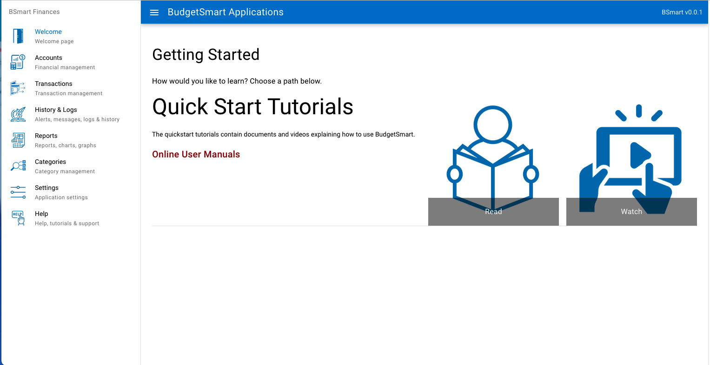
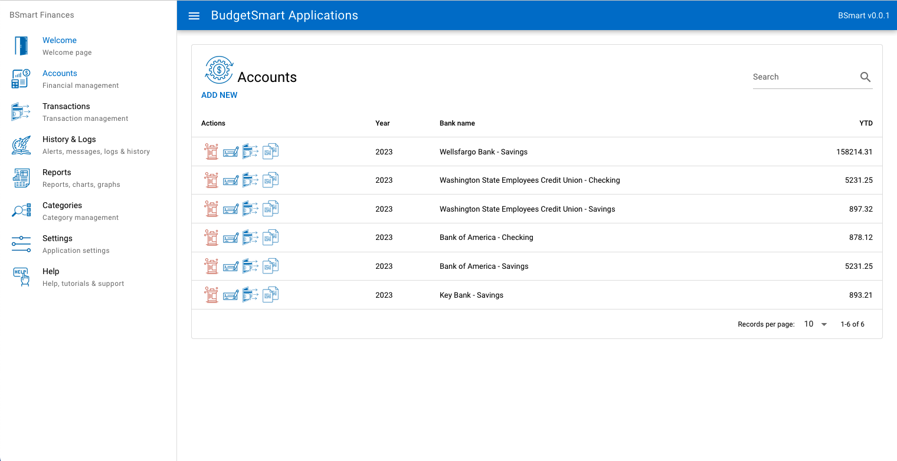
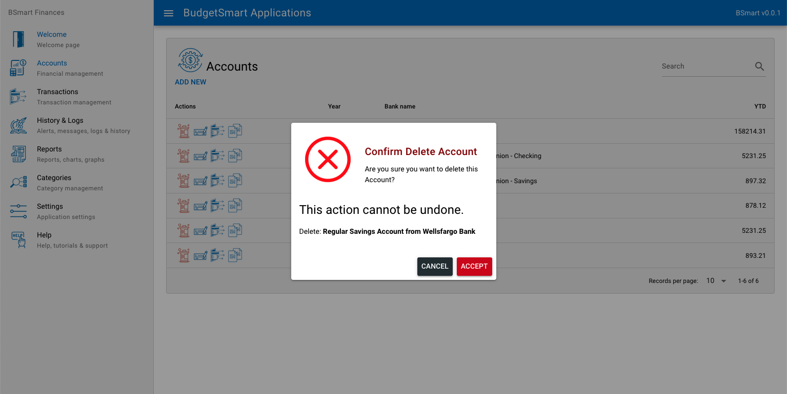
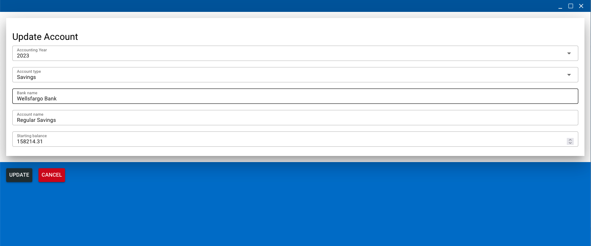

# Financial app (bsmart-applications)

Personal Management tools

# Screenshots


## Welcome screen



## Accounts list



## Delete confirmation



## Update Opening Balance




## Update Transactions screen


## Update Account


## Roadmap
- Financial management
- Shopping Lists


## Install the dependencies
```bash
yarn
# or
npm install
```

### Start the app in development mode (hot-code reloading, error reporting, etc.)
```bash
quasar dev
```


### Build the app for production
```bash
quasar build
```

### Customize the configuration
See [Configuring quasar.config.js](https://v2.quasar.dev/quasar-cli-vite/quasar-config-js).
